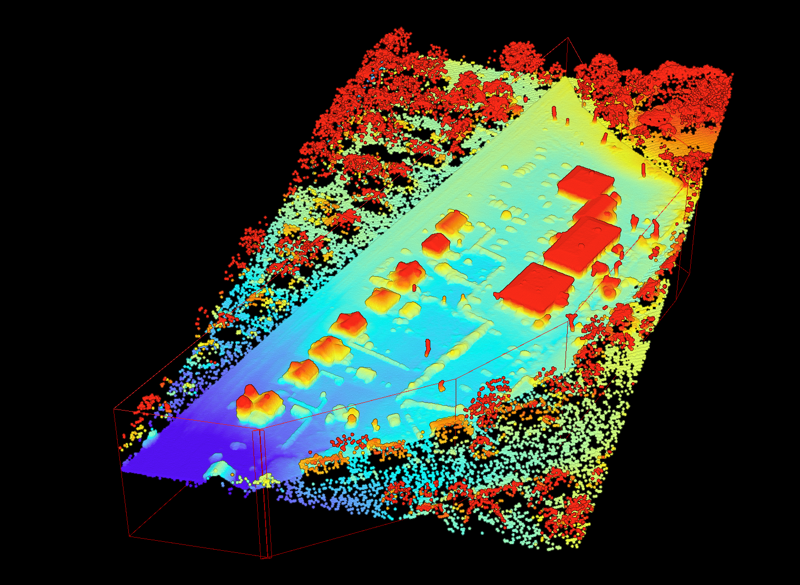
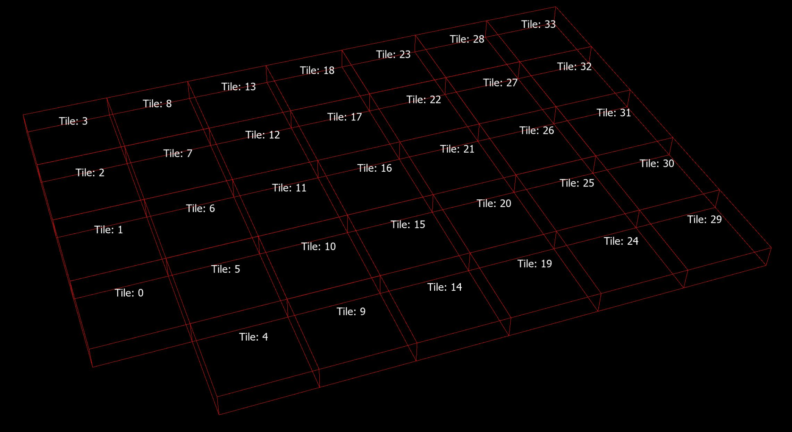
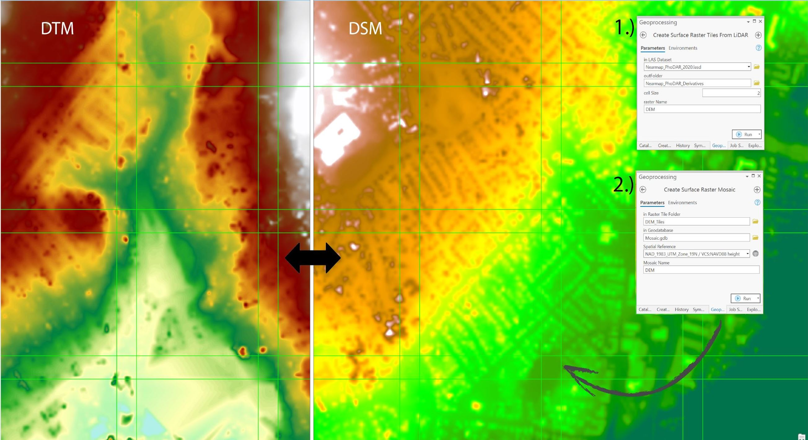

# ArcGIS Nearmap Data Processing Tools

Tools for working with Nearmap Data in ArcGIS Pro

1.) Download the GitHub Repo.
- Either download the repository as a zipfile and extract on your computer
- Or use https://desktop.github.com/, https://git-scm.com/, or git within a development IDE to clone this repository

2.) Connect to the toolbox/s to your arcgis pro project
- Learn more about connecting to toolboxes in ArcGIS Pro: https://pro.arcgis.com/en/pro-app/latest/help/projects/connect-to-a-toolbox.htm

# GeoProcessing Tools Included:

- **PointCloud Processing Toolbox**: _(License Requirements: ArcGIS Pro, 3D Analyst, Spatial Analyst)_
  - **PointCloud Updater**: Process for updating areas of an existing PointCloud with new PointCloud collects.
  
  - **Create LAS Dataset Recursive**: Process for generating LAS Datasets (.lasd file) from data generated in the "PointCloud Updater GP tool".
    - _Note: required as Esri's default create las dataset will not recursively search folders for lidar files._
    

- **Create Surface Raster Tiles Toolbox**: _(License Requirements: ArcGIS Pro, 3D Analyst)_
  
  - **Create Surface Raster Tiles from PointClouds**: Process for generating Raster Surface Tiles from PointCloud data
  - **Create Surface Raster Mosaic**: Process for generating mosaic datasets for surface raster data generated in the "Create Surface Raster Tiles from PointClouds GP tool"
  
**How-To videos coming soon!**

Contact: geoff.taylor@nearmap.com with any questions/bugs/issues.
